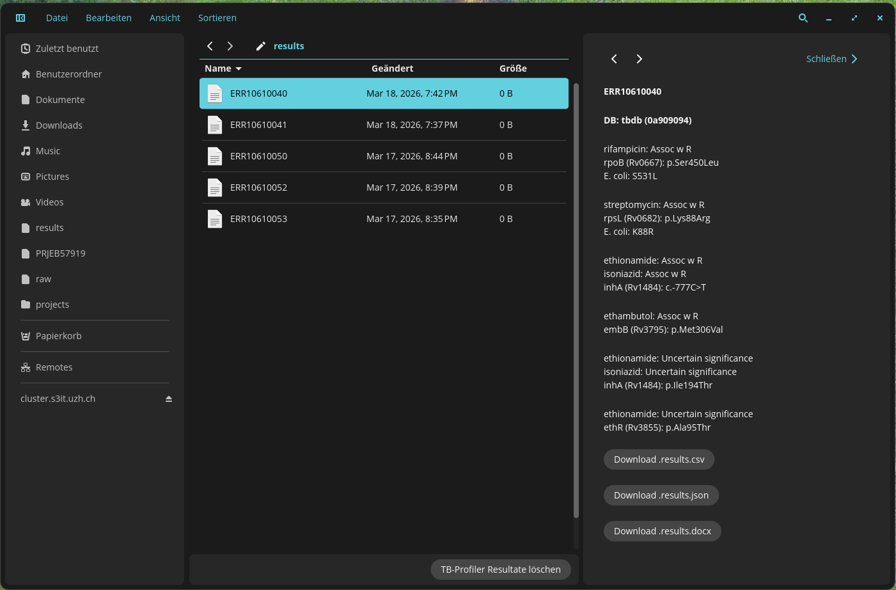

# TB File Browser
Forked from [cosmic-files](https://github.com/pop-os/cosmic-files.git)

For now, SSH connections must be configured using a private and public key pair (password authentication is not supported).

## Databases
[Web-accessible database of hsp65 sequences from Mycobacterium reference strains.](https://europepmc.org/article/pmc/pmc3122750)

## Video demo and screenshots
[Watch the video demo](https://uzh-my.sharepoint.com/:v:/g/personal/mmeuli_imm_uzh_ch/IQD_a1nF7GIERr8estD8dh6dAYRmVTwai_oXr9QwfKKUSwo?nav=eyJyZWZlcnJhbEluZm8iOnsicmVmZXJyYWxBcHAiOiJPbmVEcml2ZUZvckJ1c2luZXNzIiwicmVmZXJyYWxBcHBQbGF0Zm9ybSI6IldlYiIsInJlZmVycmFsTW9kZSI6InZpZXciLCJyZWZlcnJhbFZpZXciOiJNeUZpbGVzTGlua0NvcHkifX0&e=BmbT7P)

[Screenshots](https://uzh-my.sharepoint.com/:f:/g/personal/mmeuli_imm_uzh_ch/IgANQxBmjwxaTpjCTdDPgocxAdiRcxx5qaYzsTE9Twfyx8k?e=1Fv4ag)

### Dev
On branch tbprofiler run on Windows with:
$env:RUST_LOG="info"; cargo run

